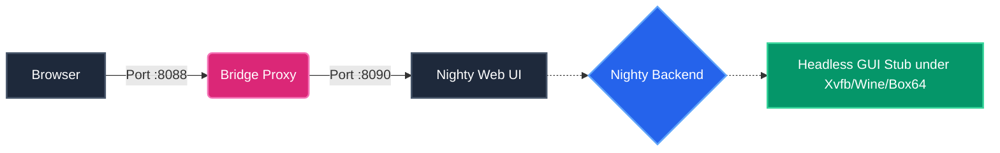

# nighty-linux-headless

**Run Nighty headless on Linux and access its built-in Web UI effortlessly over your LAN** — even without a desktop environment! 

It natively repackages Nighty to run perfectly on Linux servers. On **x86-64**, Nighty runs natively under Wine. On **ARM64** (like Raspberry Pi), it runs flawlessly through an x86-64 emulator (Box64) under Wine. 

> [!WARNING]
> **Disclaimer:** This is an unofficial, community interop/automation tool. It is **not** affiliated with or endorsed by Nighty. It does **not** include, redistribute, crack, or unlicense Nighty — you must supply your own legally obtained copy and valid license. Nighty is a Discord **selfbot**; automating a user account can violate Discord's Terms of Service. Use it only with your own account, on your own hardware, at your own risk.

---

## How it works (Short Version)



*For full technical details, check out [`docs/ARCHITECTURE.md`](docs/ARCHITECTURE.md).*

---

## Features

- **Bring-Your-Own-Binary:** Just drop in your own `Nighty.exe`. Updates stay your choice (just re-run the installer with a newer exe).
- **True Headless GUI Stub:** Repacks the executable with a no-op webview stub so the backend + Web UI start silently without a renderable desktop. Licensing and protected code remain strictly untouched.
- **Configurable Web UI Login:** You set the username/password in `.env`.
- **Always-On Web UI (Hard Enforcement):** If Nighty or the user disables the Web UI, the guard forces it back on instantly so you never lose control of your headless bot.
- **Quiet Mode by Default:** Every `toast` and `sound` option is automatically disabled before each launch.
- **Persistence:** Runs as a `systemd` service or Docker container to survive crashes and reboots.
- **Docker Support:** Deploy effortlessly on any Linux server without polluting your host with Wine or Xvfb.

---

## Requirements

You only need three things — **the installer handles the rest**:

1. Any **Linux** host with **`sudo`** access and an **internet connection**.
2. Your own **`Nighty.exe`** and a valid Nighty license.
3. A supported package manager for auto-install (**apt**, **dnf**, **pacman**, or **zypper**). 

> [!NOTE]
> The `scripts/install.sh` script checks what is already present and **installs only what is missing**:
> - Base tools (curl/tar/xz/gnupg), **Python 3**, **Xvfb**, and **`uv`**.
> - On **x86-64**: **Wine** (version 10 or newer). If your distro Wine is too old (Ubuntu 22.04/24.04), it transparently falls back to a self-contained static Wine build. Your system Wine is untouched.
> - On **non-x86** (ARM): **Box64** plus a static x86-64 Wine build. Hardware is detected automatically.

*Re-running the installer is completely safe: anything already set up is detected and skipped.*

---

## Quick Start

### Method 1: Docker (Recommended)
*Supported on **x86-64 (`amd64`)** and **64-bit ARM (`arm64`, including Raspberry Pi 5)**.*

The easiest deployment method. It runs cleanly inside a secure container, storing your passwords in local secret files with restrictive permissions. Your licensed binary and runtime data are safely bind-mounted.

**1. Download & Configure:**
Run the following command on your server to download the repository and set your credentials:
```bash
bash <(curl -sL https://raw.githubusercontent.com/glowxx/nighty-linux-headless/main/scripts/docker-install.sh)
```

**2. Upload your Executable:**
After the script finishes, upload your `Nighty.exe` to the server (`$HOME/nighty-linux-headless`) using an SFTP client (like FileZilla or WinSCP).

**3. Start the Bot:**
```bash
cd "$HOME/nighty-linux-headless"
bash scripts/docker-start.sh
```

> [!TIP]
> After booting, view the Web UI by visiting `http://<your-server-ip>:8088/` in your browser!

**Uninstalling Docker Setup:**
If you need to completely remove the bot and all of its data, use our interactive uninstaller and select the **Full uninstall (Docker)** option:
```bash
bash <(curl -sL https://raw.githubusercontent.com/glowxx/nighty-linux-headless/main/scripts/uninstall.sh)
```

---

### Method 2: Bare Metal
For advanced users who want to run Nighty directly on their host OS.

```bash
git clone <your-fork-url> nighty-linux-headless
cd nighty-linux-headless

# 1. Put YOUR binary here
cp /path/to/Nighty.exe .

# 2. Install missing dependencies & repack into Nighty_stub.exe (asks for sudo)
bash scripts/install.sh

# 3. Set your Web UI username/password
$EDITOR .env

# 4. Start everything
bash scripts/run.sh
```

**The Orchestrator (`run.sh`)** brings up the whole stack (virtual display, config enforcement, LAN bridge, and backend). With no arguments it shows a menu:
```text
  1) Run now (one-off, in this terminal)
  2) Set up autostart (systemd) - starts automatically on every boot
```
Choose **2** and it installs a systemd service for you. You can also skip the menu:
```bash
bash scripts/run.sh once        # run in this terminal
bash scripts/run.sh autostart   # install + enable the systemd service
```

> [!WARNING]
> Only one stack can own a runtime at a time. If Nighty is already running, another `run.sh` invocation exits safely. **Do not background the menu with `&`** as it can't read your keypress.

---

## Setup Wizard

When you open `http://<host-ip>:8088/` for the first time, you are greeted by a single guided wizard that collects everything up front, validates each step against Discord, and writes Nighty's config directly so it boots fully set up in **one** start.

1. **Activate:** Paste your **Nighty license key**. *(Without a license the bot can sign in, but no commands will work!)*
2. **Sign In:** Paste your Discord **account token**. 
3. **Connect your Bot:** Paste your **bot token** (Developer Portal → your app → **Bot** → *Reset Token*). The bridge verifies it has the required privileged intents (Presence, Server Members, Message Content).
4. **Authorize:** Open the **Authorize on Discord** link and approve the bot on your account. 

> [!IMPORTANT]
> The setup is strictly gated. The wizard **refuses to finish** until the bot is actually linked, so you never end up with an unauthorized bot.

**Adding another account:**
Run `bash scripts/add_account.sh` on the host. It re-opens the same wizard retitled "Add account" and writes the new login straight into `nighty.config` before restarting Nighty.

---

## Updating Nighty

If new fixes or features are pushed to this repository, you can update your deployment instantly without losing any data! 

**The updater universally supports both Docker and Bare Metal deployments.** It will seamlessly detect which method you used, safely pull the latest changes, cleanly update any dependencies, and restart your container or background service automatically.

```bash
bash <(curl -sL https://raw.githubusercontent.com/glowxx/nighty-linux-headless/main/scripts/update.sh)
```

---

## Configuration

All settings live in `.env` (copy from `.env.example`). Key ones:

| Variable | Meaning |
|---|---|
| `NIGHTY_EXE` / `NIGHTY_STUB` | your original exe / the repacked stub |
| `NIGHTY_HOME`, `WINEPREFIX` | runtime + Wine prefix locations |
| `WEBUI_USERNAME`, `WEBUI_PASSWORD` | **your** Web UI login |
| `WEBUI_HOST`, `WEBUI_PORT` | native panel bind (keep loopback) |
| `BRIDGE_HOST`, `BRIDGE_PORT` | LAN bridge bind (what you open) |
| `STUB_PORT` | stub control server (keep loopback) |
| `DISPLAY_NUM` | Xvfb display number |
| `ENFORCE_WEBUI`, `ENFORCE_INTERVAL` | Web UI hard-enforcement |

---

## Real-time (WebSockets)

Nighty's native Web UI uses **socket.io (WebSockets)** for live updates. The bundled bridge tunnels them with a `select()`-based full-duplex pump that disables Nagle (`TCP_NODELAY`) and enables TCP keepalive, so the connection stays up flawlessly. No extra software is required for stable real-time over the LAN.

*(If you want TLS or are fronting a high-traffic deployment, an optional [`Caddyfile.example`](Caddyfile.example) is included for reverse proxy setup).*

---

## Where your data lives (and how to fully reset)

Nighty's state is stored **outside this repo**. Deleting the project folder does **not** reset Nighty! Everything persists under **`$NIGHTY_HOME`** (default `~/.local/share/nighty`):

- `…/prefix/` - the Wine prefix (License, tokens, Web UI creds, themes, scripts).
- `…/wine/` - the bundled Wine, plus the logs.

Once initial setup completes, the box is **locked** with a `.setup_locked` marker so the setup screens are never shown again. 

### Resetting Configuration
To unlock and re-run setup, use the interactive uninstaller:
```bash
bash <(curl -sL https://raw.githubusercontent.com/glowxx/nighty-linux-headless/main/scripts/uninstall.sh)
```
Select the **Reset configuration** option matching your deployment method to safely wipe tokens/license/auth only, then restart Nighty for a fresh setup flow.

---

## Security Notes

- Only the **bridge (8088)** is meant to be LAN-reachable.
- The bridge does not store tokens; it securely forwards them to the local backend.
- The LAN bridge has no transport encryption — run it only on a trusted LAN, or put it behind a VPN for remote access.
- Your `.env` (credentials) and Wine prefix (tokens) are git-ignored. Never commit them!

---

## Troubleshooting

### 📂 Easy Diagnostics & Log Sharing

All diagnostic logs and auto-generated system summaries are continuously collected and rotated directly in the **`diagnostics/`** directory in the project root:
- **`system_info.txt`** — Complete sanitized environment, memory, disk, network, and crash signature report.
- **`backend.log`** — Wine, emulator, and backend execution stream.
- **`nighty.log`** — Nighty bot internal Discord engine and command logs.
- **`bridge.log`** — Web UI bridge & proxy log.
- **`guard.log` & `xvfb.log`** — Configuration guard and virtual display logs.

If you ever encounter an issue or need help, simply share the files from your **`diagnostics/`** folder — all private tokens and passwords are automatically redacted.

> [!TIP]
> **"Nighty is already running"**
> This is the single-instance guard working. Open the panel URL printed by the command. If the reported process is unhealthy, inspect `systemctl status nighty` and `journalctl -u nighty -f`; do not start a competing copy against the same ports and Wine prefix.

> [!WARNING]
> **`Bad EXE format` on ARM**
> ARM/Box64 requires an x86-64 `PE32+` Nighty.exe. The installer now validates the PE header before repacking and stops with a clear message when a 32-bit or damaged executable is supplied.

> [!NOTE]
> **Box64 reports missing libraries** (`libXcomposite`, `libXi`, etc.)
> Re-run `bash scripts/install.sh`. On apt-based systems it installs the missing native Wine/X11 runtime libraries. Other distributions receive a library list without guessed package names.

> [!CAUTION]
> **Bot is online but no commands work / "application command not found"**
> This is a **missing Nighty license**. Unlicensed, Nighty's `on_ready` aborts before it registers its command tree. Complete step 1 (Activate) with your Nighty license key and reconnect.

> [!IMPORTANT]
> **Authorization problems** ("asks to authorize", bot disconnected, or stuck on the auth screen)
> If your bot is not authorized on your Discord account (or you disconnected/removed it), Nighty cannot work and the bridge shows an **Authorize** page with a direct OAuth link.
> If the box is already locked, **reset the configuration** using `uninstall.sh` to safely delete only your license and tokens, then restart Nighty so it re-runs the wizard.

> [!WARNING]
> **"Some intents are OFF" on the bot step**
> Your bot application doesn't have the privileged gateway intents enabled. Click the link the page gives you (Developer Portal → your app → **Bot**), turn on **Presence**, **Server Members** and **Message Content**, press **Save Changes**, then **Validate & connect** again.

### Docker Troubleshooting

- **"WEBUI_USERNAME is missing" error in logs:** Ensure you did not create the `docker-secrets` folder manually. The installer handles this to prevent permission conflicts between your host user and the container user. Re-run `bash scripts/docker-install.sh`.
- **Docker Compose commands fail:** Ensure Docker and Docker Compose (v2) are installed. If using an older Ubuntu version, `apt install docker-compose-plugin` might be required.
- **Cannot connect to Web UI on Docker:** Check if port `8088` is already in use by another service on your host, or blocked by a firewall (like UFW or iptables).
- **Container restarts constantly:** View the live logs using `docker compose logs -f nighty`. The logs will specify if your `Nighty.exe` is missing or if the bot failed to start due to bad credentials.

<details>
<summary><b>Click to view advanced troubleshooting & bug fixes...</b></summary>

- **Repack fails / "bad marshal data"**: The repack must run under Python 3.8. Let `install.sh` use the `uv`-provided 3.8 interpreter.
- **Backend never opens 8090**: It only starts after a successful login. Open the bridge and complete the onboarding flow.
- **Disk usage grows after repeated backend restarts**: Forced watchdog exits cannot remove Nighty's `_MEI*` extraction directory. `run.sh` now removes stale directories automatically. To clean manually, stop Nighty and run `bash scripts/cleanup_mei.sh`.
- **On x86-64, the backend hangs at startup (no `[STUBWV]` logs)**: Your distro Wine is too old (Wine 6-9). The installer detects this and falls back to a static Wine 10 build automatically. Re-run `bash scripts/install.sh`.
- **On non-x86 hosts, Wine crashes with illegal-instruction**: You need a recent **Box64** built for your CPU.
- **The menu prints but typing `1`/`2` does nothing**: You backgrounded `run.sh` with `&`. Run it in the foreground, or use `bash scripts/run.sh once`.
- **Backend keeps exiting / "Disconnected - Reconnecting"**: Make sure the headless DLL overrides are active (`run.sh` sets `WINEDLLOVERRIDES`).
- **Bot is very slow / "application did not respond"**: On emulated hosts this is caused by Nighty's Rich-Presence task fetching lyrics from `lrclib.net` via blocking calls. `install.sh` blackholes `lrclib.net` in `/etc/hosts` so it fails instantly. On ARM, ensure `NIGHTY_BOX64_PROFILE=balanced`.
- **The loading screen remains after the stub starts**: If a transient Discord error leaves the backend half-started, the watchdog restarts the backend after `WEBUI_BOOT_TIMEOUT`.
- **A Rich-Presence preset crashes backend under emulation**: Running an **RPC** preset makes Nighty fetch image assets through `tls-client`, which intermittently segfaults under Box64. The config guard disables auto-start for RPC profiles to prevent boot-loops.
- **"Error downloading sound ... HTTP Error 403: Forbidden"**: Cloudflare blocks Nighty's default `urllib` agent. The config enforcer pre-seeds `data/sounds/` using a browser User-Agent at launch to skip the blocked request.
</details>

---

## Support

If this project saved you some time, a tip is hugely appreciated — thank you! 

- **Ko-fi:** https://ko-fi.com/glowxx
- **Litecoin (LTC):** `ltc1qz76tezwulr25xmv8xzzu7wgs9rkjl20mlplgew`

## License
MIT for the wrapper code in this repo. See `LICENSE`. *(Note: Nighty itself is proprietary and not included).*
